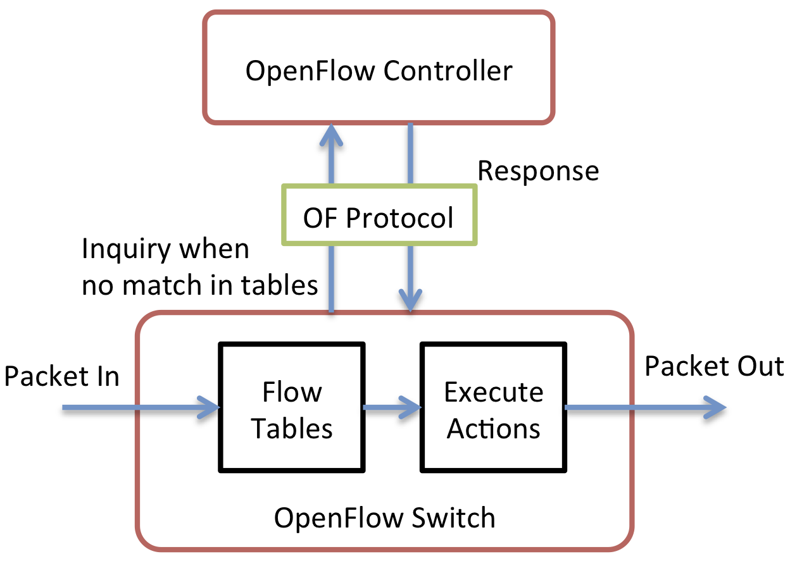
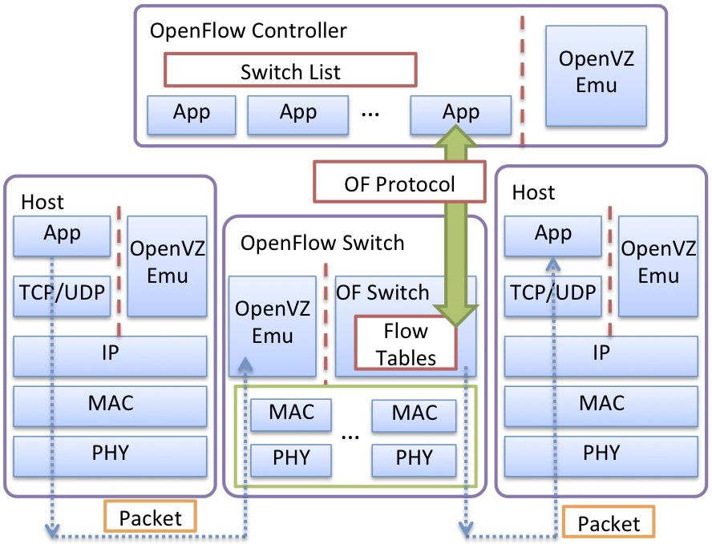

OpenFlow
---------------------------------
	
	
OpenFlow Overview
==================

In a traditional network architecture, the control plane and the data plane cooperate within a device via internal protocols. By contrast, in an SDN (software-defined network), the control plane is separated from the data plane, and the control logic is moved to an external controller. The controller monitors and manages all of the states in the network from a central vantage point. The controller talks to the data plane using the `OpenFlow protocol <http://www.openflow.org/documents/openflow-spec-v1.1.0.pdf>`_, which defines the communication between the controller and the data planes of all the forwarding elements. The controller can set rules about the data-forwarding behaviors of each forwarding device through the OpenFlow protocol, including rules such as drop, forward, modify, or enqueue. 

Each OpenFlow switch has a chain of flow tables, and each table stores a collection of flow entries. A flow is defined as the set of packets that match the given properties, e.g., a particular pair of source and destination MAC addresses. A flow entry defines the forwarding/routing rules. It consists of a bit pattern that indicates the flow properties, a list of actions, and a set of counters. Each flow entry states "execute this set of actions on all packets in this flow," e.g., forward this packet out of port A. Figure :ref:`ofsgeneral` shows the main components of an OpenFlow-based SDN and the procedures by which an OpenFlow switch handles an incoming packet. When a packet arrives at a switch, the switch searches for matched flow entries in the flow tables and executes the corresponding lists of actions. If no match is found for the packet, the packet is queued, and an inquiry event is sent to the OpenFlow controller. The controller responds with a new flow entry for handling that queued packet. Subsequent packets in the same flow will be handled by the switch without contacting the controller, and will be forwarded at the switch’s full line rate. 

.. _ofsgeneral:

   
   How an OpenFlow Switch Handles Incoming Packets

OpenFlow in S3FNet
====================

We have developed a large-scale, high-fidelity network testbed by integrating the OpenVZ network emulation into S3F/S3FNet, and extended the testbed to support OpenFlow-based SDN simulation and/or emulation. Figure :ref:`arch-sdn` shows the overall system architecture on a single physical machine. The system consists of three major components: OpenVZ, the network emulation system; S3F, the system kernel; and S3FNet, the parallel network simulator.

.. _arch-sdn:
.. figure::  images/arch-sdn.png
   :width: 30 %
   :align:   center
   
   S3F System Architecture Design with OpenFlow Extension

* OpenFlow Emulation

  To emulate OpenFlow-based networks, we can run unmodified OpenFlow switch and controller programs in the OpenVZ containers (VEs), and the network environment (such as wireless or wireline media) is simulated by S3FNet. Since the executables are run on the real network stacks within the containers, the prototype behaviors are close to the behaviors in real SDNs. Once an idea works on the testbed, it can be easily deployed to production networks. Other OpenFlow emulation testbeds, like `Mininet <http://mininet.org/>`_, have good functional fidelity too, but lack performance fidelity, especially with heavy loads. Imagine that one OpenFlow switch with ten fully loaded gigabit links is emulated on a commodity physical machine with only one physical gigabit network card. There is no guarantee that a switch ready to forward a packet will be scheduled promptly by the Linux scheduler in real time. Our system does not have such limitations, since the emulation system is virtual-time embedded. The experiments can run faster or slower depending on the workload. When load is high, performance fidelity is ensured by running the experiment slower than real time. On the other hand, when the load is low, we can reduce the execution time by quickly advancing the experiment. 

* OpenFlow Simulation

  Our OpenFlow simulation model has two main components: OpenFlow switch and OpenFlow controller. Switches and controllers communicate via the OpenFlow protocol, and the protocol library we use is the OpenFlow `reference implementation <http://www.openflow.org/wp/downloads>`_ at Stanford University. The initial version of the switch and the controller models have been developed with reference to the `ns-3 OpenFlow models <http://www.nsnam.org/docs/release/3.13/models/ html/openflow-switch.html>`_.  Figure :ref:`implementation-sdn` depicts the model implementation details. The OpenFlow switch is implemented as a S3FNet protocol session above multiple network interfaces. The controller can be implemented in two ways: a protocol session in an individual host entity, or an object that interacts with switches through direct function calls. 

* Journey of a packet

  Figure :ref:`implementation-sdn` also shows the journey of a packet in the system. A packet is generated at the source end-host, either from the simulated application layer or from the real network application in a container. The packet is pushed down through the simulated network stacks of the host and then is popped up to the OpenFlow switch via the connected in-port. Depending on the emulation or simulation mode of the switch (the OpenVZEmu protocol model is used to handle the case where the entity is associated with a virtual-machine container), the packet is searched within the simulated flow tables or the real flow tables in the container, and a set of actions are executed when matches are found. Otherwise, a new flow event is directed to the controller, meaning either the simulated controller model or the real controller program in the container. The controller generates new flow entries and installs the flow entries onto the switches via the OpenFlow protocol. Afterwards, the switch knows how to process the incoming packet (and subsequent additional packets of this type), and transmit it via the correct out-port. Eventually the packet is received by the application running on the destination end-host.

.. _implementation-sdn:

   
   OpenFlow Implementation in S3FNet

File Organization
==================

The diagram below lists all the related files for the OpenFlow model. A sample learning switch controller model is implemented in two versions (protocol-session-based and non-protocol-session-based). A number of OpenFlow test cases are also available in s3fnet/test/openflow. ::

 s3fnet
 ├── src
 │   ├── os
 │   │   └── openflow_switch			# OpenFlow switch and controller models
 │   │       ├── openflow_controller.cc		
 │   │       ├── openflow_controller.h		# Model of the OpenFlow controller (non-protocol-session), e.g., LearningController, DropController
 │   │       ├── openflow_controller_session.cc  
 │   │       ├── openflow_controller_session.h	# Model of the OpenFlow controllers (protocol session), e.g., LearningControllerSession
 │   │       ├── openflow_interface.cc		
 │   │       ├── openflow_interface.h		# Interfaces for interaction among openflow switches and controllers, as well as interacting with openflow library 
 │   │       ├── openflow_message.cc		
 │   │       ├── openflow_message.h		# Communication message between OpenFlow switches and controllers
 │   │       ├── openflow_switch_session.cc
 │   │       └── openflow_switch_session.h	# Model of the OpenFlow switch (protocol session)
 ├── test
 │   └── openflow				# Test cases for OpenFlow models
 │
 └── openflowlib				# OpenFlow library 

